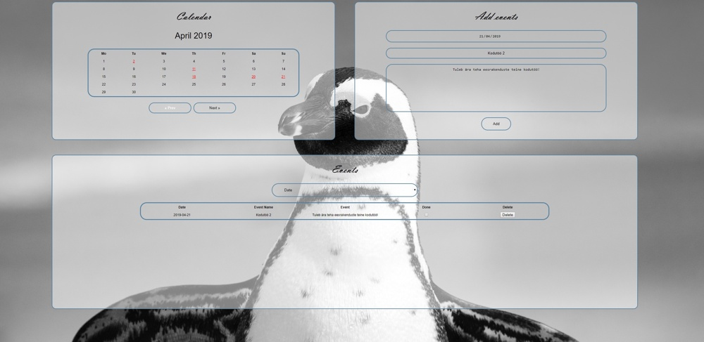

<h1>2. kodutöö – ToDo rakendus</h1>

Veebileht on tehtud Kent Pirma ja Kaspar Rasmus Eelmaa poolt. 
Nähtav http://www.tlu.ee/~ras127/todo/ 

<h2>Tööjaotus</h2>

Kaspar Rasmusele meeldib CSS ja HTML kirjutamine kõvasti rohkem kui funktsionaalsuse kirjutamine ning  Kentile vastupidi, siis oli väga kerge otsustada, et kes mida teeb.

<h2>Funktsionaalsus</h2>

Saab lisada/kustutada ülesandeid/evente. Dropdown menüüst saab järjestada sissekandeid ajaliselt, nimeliselt ning sorteerida tegemata ülesanded. Kalendrist saab vaadata kindla tähtpäevaga ülesandeid.

<h2>Raskused</h2>

Peamiselt esines raskuseid kalendri tegemises.

